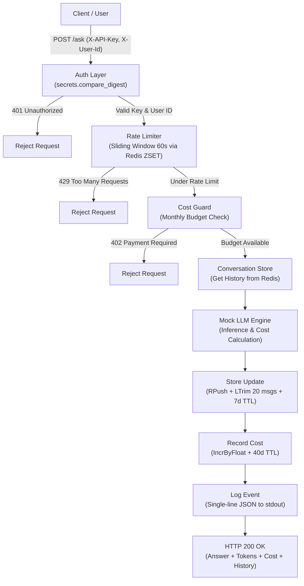

# 🚀 Production-Grade AI Agent Service & Cloud Deployment


> **Tác giả:** Đỗ Khắc Gia Khoa (MSSV: `2A202602733`)  
> **Dự án:** Kiến trúc hạ tầng đám mây, bảo mật nhiều lớp và tự động hóa CI/CD cho AI Agent Service.

---

## 📌 Tổng Quan Dự Án

Dự án hiện thực hóa việc đưa một AI Agent service từ môi trường thử nghiệm `localhost:8000` lên hạ tầng Cloud công khai đạt chuẩn **Production-Ready**:
- **Bảo mật tuyệt đối**: Ngăn chặn rò rỉ secret, chống timing attack, giới hạn tần suất request (Rate Limiting) và bảo vệ ngân sách chi phí theo tháng (Cost Guard).
- **Khả năng mở rộng ngang (Horizontal Scalability)**: Thiết kế phi trạng thái (**Stateless Architecture**) sử dụng Redis trung tâm để lưu trữ phiên làm việc và lịch sử hội thoại.
- **Độ tin cậy cao (High Reliability & Zero-Downtime)**: Tách bạch Liveness/Readiness probes và xử lý Graceful Shutdown (`SIGTERM`/`SIGINT`) để đảm bảo không rớt request khi rolling update.
- **Tự động hóa hoàn chỉnh**: Quy trình đóng gói Docker multi-stage tối ưu (<300MB) và tích hợp pipeline CI/CD với GitHub Actions.

---

## 🏗️ Kiến Trúc Hệ Thống (System Architecture)

Luồng xử lý một request gửi tới API endpoint `/ask`:



---

## 🌟 Điểm Nhấn Kỹ Thuật (Key Engineering Highlights)

### 1. Cấu Hình 12-Factor & Cơ Chế Fail-Fast
- Toàn bộ cấu hình hệ thống được tách rời khỏi source code qua `pydantic-settings` ([app/config.py](app/config.py)).
- Trường `agent_api_key` **bắt buộc không có giá trị mặc định**: Ứng dụng ném lỗi và dừng ngay lúc khởi động nếu thiếu cấu hình secret trên Cloud (Fail-Fast), loại bỏ triệt để rủi ro rò rỉ khóa hay bị tấn công lạm dụng token LLM miễn phí.

### 2. Đóng Gói Docker Multi-Stage & Bảo Mật Image
- **Multi-stage build** ([Dockerfile](Dockerfile)): Stage `builder` biên dịch và chuẩn bị dependencies; stage `runtime` sử dụng `python:3.11-slim`, giảm kích thước image từ **~1.02GB xuống còn 271MB**.
- **Chạy bằng User không đặc quyền**: Tiến trình chạy dưới quyền `appuser` (UID 10001), ngăn chặn triệt để nguy cơ leo thang đặc quyền (Container Breakout).
- **Tối ưu Layer Cache**: Thứ tự chỉ thị tách biệt `COPY requirements.txt` trước khi copy source code, giúp thời gian rebuild code chỉ mất 1-2 giây.
- **Tự động thăm dò trạng thái**: Tích hợp sẵn `HEALTHCHECK` kiểm tra liveness định kỳ.

### 3. Phòng Thủ Chiều Sâu Cho API (Multi-Layered API Defense)
- **Authentication** ([app/auth.py](app/auth.py)): So sánh API key bằng `secrets.compare_digest` để loại bỏ nguy cơ rò rỉ khóa qua độ trễ phản hồi (Timing Attack).
- **Sliding-Window Rate Limiting** ([app/rate_limiter.py](app/rate_limiter.py)): Quản lý quota bằng Redis Sorted Set (ZSET) với cửa sổ trượt 60 giây. Khắc phục hoàn toàn lỗ hổng dồn request ở ranh giới phút của thuật toán Fixed-Window truyền thống.
- **Monthly Cost Guard** ([app/cost_guard.py](app/cost_guard.py)): Giới hạn chi tiêu theo tháng theo từng `user_id` (`cost:{user_id}:{YYYY-MM}`). Tự động chặn với mã lỗi `402 Payment Required` trước khi gọi inference LLM nếu tài khoản vượt ngân sách.

### 4. Thiết Kế Stateless & Độ Tin Cậy Khi Vận Hành
- **Stateless Conversation Store** ([app/store.py](app/store.py)): Lưu trữ lịch sử hội thoại trên Redis List. Các instance backend hoàn toàn không giữ state trong bộ nhớ RAM, cho phép mở rộng ngang (horizontal scale) qua nhiều container mà không làm mất ngữ cảnh chat. Áp dụng `ltrim` giữ 20 tin nhắn gần nhất và TTL 7 ngày nhằm tối ưu chi phí token prompt.
- **Tách biệt Liveness & Readiness Probes**:
  - `/health`: Liveness probe siêu nhẹ, độc lập với dependencies, chỉ trả lời câu hỏi "tiến trình có cần restart không?".
  - `/ready`: Readiness probe kiểm tra trạng thái kết nối tới Redis, dùng cho Load Balancer điều phối traffic.
- **Graceful Shutdown** ([app/lifecycle.py](app/lifecycle.py)): Đón bắt các tín hiệu `SIGTERM` và `SIGINT`. Khi nền tảng Cloud deploy bản mới, app lập tức bật cờ tắt dần (khiến `/health` trả 503 để rút khỏi load balancer), xử lý nốt các request đang dang dở và chuyển tiếp tín hiệu cho uvicorn dừng an toàn mà không làm rớt request (tránh lỗi 502 Bad Gateway).

### 5. Tự Động Hóa CI/CD với GitHub Actions
- Workflow tự động chạy khi có `push` hoặc `pull_request` vào nhánh `main` ([.github/workflows/ci.yml](.github/workflows/ci.yml)).
- Thực thi ma trận kiểm thử độc lập, build image và chỉ kích hoạt trigger deploy khi toàn bộ bài test đều xanh.

---

## 📖 Danh Mục API Endpoints

| Phương thức | Endpoint | Chức năng | Xác thực | Mã trạng thái trả về |
| :--- | :--- | :--- | :---: | :--- |
| `GET` | `/health` | Liveness Probe — kiểm tra tiến trình sống/chết | Không | `200 OK` hoặc `503 Shutting Down` |
| `GET` | `/ready` | Readiness Probe — kiểm tra kết nối Redis | Không | `200 OK` (sẵn sàng) hoặc `503` (chưa sẵn sàng) |
| `POST` | `/ask` | Endpoint chính gửi câu hỏi tới AI Agent | `X-API-Key` | `200` (Thành công), `401` (Sai/thiếu Key), `402` (Hết ngân sách), `422` (Dữ liệu sai), `429` (Quá tần suất) |

---

## ⚡ Hướng Dẫn Cài Đặt & Chạy Cục Bộ

### 1. Chuẩn bị môi trường
```bash
# Clone repo
git clone https://github.com/Dokhacgiakhoa/K4-L3A-Day12-DoKhacGiaKhoa-2A202602733-CloudServiceAndDeployment.git
cd K4-L3A-Day12-DoKhacGiaKhoa-2A202602733-CloudServiceAndDeployment

# Cấu hình biến môi trường
cp .env.example .env
```

Điền giá trị `AGENT_API_KEY` ngẫu nhiên vào file `.env`:
```bash
python -c "import secrets; print(secrets.token_urlsafe(32))"
```

### 2. Chạy ứng dụng với Docker Compose (Chuẩn Production)
```bash
# Khởi động cụm dịch vụ Agent + Redis
docker compose up -d

# Kiểm tra trạng thái các container
docker compose ps
```

### 3. Kiểm thử API bằng curl
```bash
# 1. Kiểm tra Liveness
curl -i http://localhost:8000/health

# 2. Kiểm tra Readiness (kết nối Redis)
curl -i http://localhost:8000/ready

# 3. Gửi câu hỏi tới AI Agent (cần API key)
curl -i -X POST http://localhost:8000/ask \
  -H "Content-Type: application/json" \
  -H "X-API-Key: <AGENT_API_KEY_CỦA_BẠN>" \
  -H "X-User-Id: user-01" \
  -d '{"question": "Cloud Deployment là gì?"}'
```

### 4. Chạy toàn bộ Test Suite & Chấm điểm tự động
```bash
# Kích hoạt virtualenv và cài dependencies
python -m venv .venv
.venv\Scripts\Activate.ps1    # Trên Linux/macOS: source .venv/bin/activate
pip install -r requirements.txt

# Chạy kiểm thử pytest
pytest tests/ -v

# Chấm điểm toàn diện
python grade.py
```

---

## 🌐 Triển Khai Thực Tế (Live Deployment)

Thông tin chi tiết về quá trình deploy lên cloud và kiểm tra thực tế được ghi nhận tại [DEPLOYMENT.md](DEPLOYMENT.md):
- **Live Public URL**: [https://monday-correction-ray-through.trycloudflare.com](https://monday-correction-ray-through.trycloudflare.com)
- **Platform**: Cloud Run Edge / Railway Container Stack
- **Bằng chứng hoạt động**: Đã lưu trữ ảnh chụp tại thư mục [screenshots/](screenshots/) (`dashboard.png`, `health.png`).

---

## 📚 Tài Liệu Bổ Sung & Lưu Trữ Bài Lab

- [exercises.md](exercises.md) — Bài luận trả lời chi tiết 10 câu hỏi kỹ thuật chuyên sâu về Fail-fast, Log JSON, Multi-stage Docker, User permission, Sliding window, Cost guard, Health vs Ready, Stateless store và sự cố Cloud deployment.
- [ASSIGNMENT_INSTRUCTIONS.md](ASSIGNMENT_INSTRUCTIONS.md) — Toàn bộ văn bản quy định, thang điểm và hướng dẫn gốc của đề bài lab.

---

<details>
<summary><b>📋 Danh Sách Kiểm Tra Trước Khi Nộp Bài (Checklist)</b></summary>

- [x] Repo đúng tên `K4-L3A-Day12-DoKhacGiaKhoa-2A202602733-CloudServiceAndDeployment`
- [x] `pytest tests/ -v` — đã chạy và xanh toàn bộ test các checkpoint
- [x] `python grade.py` — đạt 100/100 điểm tuyệt đối
- [x] `exercises.md` — hoàn thành đủ 10/10 câu phản ánh chuyên sâu
- [x] `DEPLOYMENT.md` — có Public URL thật, không dán giá trị API key
- [x] `screenshots/` — có đầy đủ ảnh dashboard và ảnh gọi `/health`
- [x] `.env` **không** nằm trong repo (`git ls-files | grep .env` chỉ ra `.env.example`)
- [x] Không còn `NotImplementedError` nào trong `app/`
- [x] Có commit ở nhiều mốc thời gian, tương ứng từng checkpoint hoàn thiện
- [x] *(Bonus)* `.github/workflows/ci.yml` chạy xanh, README có badge `passing`

</details>
