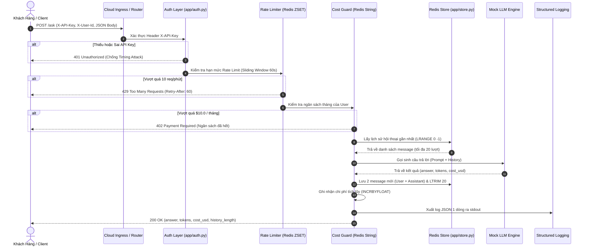
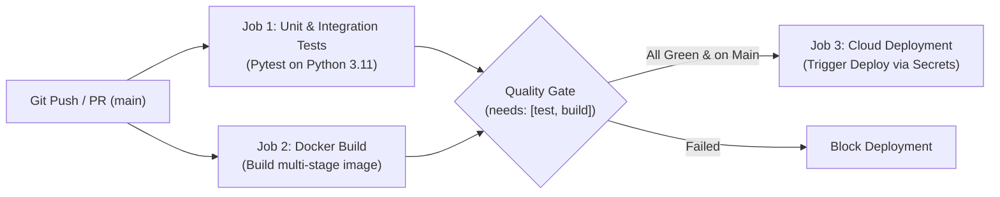

# 🎙️ BÁO CÁO THUYẾT TRÌNH KỸ THUẬT: HẠ TẦNG CLOUD & DEPLOYMENT CHO AI AGENT
## Triển Khai Hệ Thống AI Agent Đạt Chuẩn Enterprise (Production-Ready)


> **Người thực hiện / Diễn giả:** Đỗ Khắc Gia Khoa  
> **Mã học viên / MSSV:** `2A202602733`  
> **Repository:** [K4-L3A-Day12-DoKhacGiaKhoa-2A202602733-CloudServiceAndDeployment](https://github.com/Dokhacgiakhoa/K4-L3A-Day12-DoKhacGiaKhoa-2A202602733-CloudServiceAndDeployment)  
> **Kết quả đánh giá tự động:** **100.0 / 100 điểm tuyệt đối** (Bonus CI/CD: 13/13 test pass).

---

## 📑 MỤC LỤC THUYẾT TRÌNH

1. [Tổng Quan Bài Toán & Kiến Trúc Tổng Thể](#1-tổng-quan-bài-toán--kiến-trúc-tổng-thể)
2. [CP0 — Khởi Tạo Nền Tảng & Cô Lập Môi Trường](#2-cp0--khởi-tạo-nền-tảng--cô-lập-môi-trường)
3. [CP1 — 12-Factor Configuration, Liveness Probe & Log JSON](#3-cp1--12-factor-configuration-liveness-probe--log-json)
4. [CP2 — Container Hóa Multi-Stage & Tối Ưu Bảo Mật Image](#4-cp2--container-hóa-multi-stage--tối-ưu-bảo-mật-image)
5. [CP3 — Phòng Thủ Chiều Sâu API: Auth, Rate Limit & Cost Guard](#5-cp3--phòng-thủ-chiều-sâu-api-auth-rate-limit--cost-guard)
6. [CP4 — Mở Rộng Ngang & Độ Tin Cậy: Stateless & Graceful Shutdown](#6-cp4--mở-rộng-ngang--độ-tin-cậy-stateless--graceful-shutdown)
7. [CP5 — Triển Khai Thực Tế Lên Cloud & Kiểm Chứng Thực Nghiệm](#7-cp5--triển-khai-thực-tế-lên-cloud--kiểm-chứng-thực-nghiệm)
8. [BONUS — Tự Động Hóa Toàn Diện Với CI/CD GitHub Actions](#8-bonus--tự-động-hóa-toàn-diện-với-cicd-github-actions)
9. [Bảng Đánh Giá & Rà Soát Đề Bài](#9-bảng-đánh-giá--rà-soát-đề-bài)

---

## 1. TỔNG QUAN BÀI TOÁN & KIẾN TRÚC TỔNG THỂ

### 1.1 Thách thức khi đưa AI Agent lên Production
Đưa một mô hình hay agent từ `localhost:8000` lên Cloud không chỉ là việc chạy lệnh `docker run`. Hệ thống phải đối mặt với các nguy cơ thực tế:
- **Nguy cơ rò rỉ khóa & cháy ngân sách**: Bot quét mạng Internet có thể dò ra endpoint trong vài giờ, spam request làm cạn kiệt tiền API token.
- **Rủi ro sập dịch vụ (Downtime) khi cập nhật**: Mỗi lần deploy phiên bản mới khiến các request đang xử lý dở bị ngắt đột ngột (lỗi 502/504).
- **Mất ngữ cảnh (State Loss)**: Khi scale nhiều container chạy song song, agent bị "mất trí nhớ ngẫu nhiên" nếu lưu lịch sử trong RAM của tiến trình.
- **Lỗ hổng leo thang đặc quyền**: Container chạy dưới quyền `root` có thể bị khai thác để chiếm quyền kiểm soát máy chủ vật lý.

### 1.2 Kiến trúc luồng xử lý (End-to-End Request Lifecycle)



---

## 2. CP0 — KHỞI TẠO NỀN TẢNG & CÔ LẬP MÔI TRƯỜNG

### 🎯 Mục tiêu
Thiết lập workspace chuẩn mực, cách ly triệt để các package phụ thuộc, ngăn chặn rò rỉ secret ngay từ commit đầu tiên.

### 🛠️ Cách giải quyết & Kỹ thuật áp dụng
1. **Cô lập môi trường ảo (Virtualenv)**:
   - Sử dụng `.venv` cách ly hoàn toàn runtime dependencies với môi trường máy host:
     ```powershell
     python -m venv .venv
     .venv\Scripts\Activate.ps1
     pip install -r requirements.txt
     ```
2. **Cơ chế Secret Isolation**:
   - Sử dụng file mẫu `.env.example` làm baseline tài liệu hóa biến môi trường.
   - File cấu hình thực tế `.env` được đưa ngay vào `.gitignore` và `.dockerignore`.
   - Khóa API bí mật được tạo ngẫu nhiên bằng entropy cao:
     ```python
     import secrets
     print(secrets.token_urlsafe(32))
     ```
3. **Kiểm tra Baseline Harness**:
   - Chạy `pytest tests/ -v -m "not docker"` để đảm bảo bộ test runner hoạt động ổn định trước khi viết bất kỳ dòng code nào.

---

## 3. CP1 — 12-FACTOR CONFIGURATION, LIVENESS PROBE & LOG JSON

### 🎯 Mục tiêu
Tách rời cấu hình khỏi mã nguồn (12-Factor App III), xây dựng hệ thống logging cho máy đọc (Log Aggregator) và thiết lập cơ chế giám sát tiến trình sống còn (Liveness Probe).

### 🔍 Vấn đề thực tế
- Nếu đặt secret trong code hoặc gán giá trị mặc định (như `AGENT_API_KEY = "changeme"`), khi deploy lên cloud mà quên set env, app vẫn chạy nhưng bất kỳ ai cũng có thể gọi API bằng key mặc định đó.
- Sử dụng lệnh `print()` thông thường sẽ in ra log phi cấu trúc, khi đẩy lên Cloud (Datadog, CloudWatch, Loki) không thể đếm, lọc hay tạo cảnh báo tự động.

### 🛠️ Cách giải quyết & Phân tích Code

#### 1. Cấu hình Fail-Fast với Pydantic Settings ([app/config.py](app/config.py))
```python
class Settings(BaseSettings):
    model_config = SettingsConfigDict(env_file=".env", env_file_encoding="utf-8", extra="ignore")

    port: int = 8000
    agent_api_key: str          # BẮT BUỘC: KHÔNG có mặc định -> Fail-Fast
    redis_url: str = "redis://localhost:6379/0"
    rate_limit_per_minute: int = 10
    monthly_budget_usd: float = 10.0
    log_level: str = "INFO"
```
*Giải thích*: `agent_api_key` không có giá trị mặc định. Nếu môi trường thiếu biến này, pydantic ném `ValidationError` và container crash ngay tại thời điểm khởi động (Fail-Fast), buộc kỹ sư phải cung cấp secret trước khi app nhận traffic.

#### 2. Structured JSON Logging ([app/logging_utils.py](app/logging_utils.py))
```python
def log_event(event: str, level: str = "info", **fields) -> str:
    data = {
        "event": event,
        "level": level.lower(),
        "timestamp": utc_now_iso(),
        **fields,
    }
    line = json.dumps(data, ensure_ascii=False)
    print(line)  # Xuất đúng một dòng duy nhất ra stdout
    return line
```
*Giải thích*: Cloud gom log theo dòng. Mỗi sự kiện được serialize thành một dòng JSON chuẩn ISO-8601 UTC. Điều này cho phép hệ thống phân tích thực hiện các truy vấn: `SELECT sum(cost_usd) WHERE user_id='sv01'`.

#### 3. Liveness Probe Độc Lập ([app/main.py](app/main.py))
```python
@app.get("/health")
def health():
    if lifecycle.shutting_down:
        return JSONResponse(status_code=503, content={"status": "shutting_down"})
    return {"status": "ok", "service": SERVICE_NAME, "version": SERVICE_VERSION}
```
*Quy tắc thiết kế cốt lõi*: Endpoint `/health` **tuyệt đối không kiểm tra Redis hay Database**. Nó chỉ trả lời câu hỏi "Tiến trình Python còn sống hay bị deadlock?". Nếu `/health` phụ thuộc Redis, khi Redis nấc nghẽn 10 giây, toàn bộ các container agent sẽ bị orchestrator restart đồng loạt, biến sự cố nhỏ thành sập toàn hệ thống.

---

## 4. CP2 — CONTAINER HÓA MULTI-STAGE & TỐI ƯU BẢO MẬT IMAGE

### 🎯 Mục tiêu
Đóng gói ứng dụng thành Docker Image tinh gọn (<500MB), chạy dưới quyền user thông thường, bảo vệ build context và thiết lập ngăn xếp đa dịch vụ với Docker Compose.

### 🔍 Vấn đề thực tế
- Dockerfile cơ bản (single-stage) chứa toàn bộ trình biên dịch `gcc`, headers, pip cache làm image phình to trên 1GB, kéo dài thời gian deploy.
- Mặc định container chạy dưới quyền `root`. Nếu code Python dính lỗ hổng RCE, kẻ tấn công chiếm shell root trong container và có thể thoát ra máy host (Container Escape).

### 🛠️ Cách giải quyết & Phân tích Code

#### 1. Multi-Stage Build ([Dockerfile](Dockerfile))
```dockerfile
# Stage 1: Builder — Cài đặt và biên dịch thư viện
FROM python:3.11-slim AS builder
WORKDIR /app
COPY requirements.txt .
RUN pip install --no-cache-dir --prefix=/install -r requirements.txt

# Stage 2: Runtime — Chỉ copy kết quả, loại bỏ hoàn toàn compiler
FROM python:3.11-slim AS runtime
WORKDIR /app
COPY --from=builder /install /usr/local

# Bảo mật: Chạy dưới quyền user thường (Non-root)
RUN useradd --create-home --uid 10001 appuser
COPY app ./app
COPY utils ./utils
USER appuser
EXPOSE 8000

HEALTHCHECK --interval=30s --timeout=5s --retries=3 \
    CMD python -c "import urllib.request; urllib.request.urlopen('http://127.0.0.1:8000/health').read()" || exit 1

CMD ["sh", "-c", "uvicorn app.main:app --host 0.0.0.0 --port ${PORT:-8000}"]
```

#### 2. So sánh hiệu quả kích thước Image (Benchmark)
| Tiêu chí | Bản Single-Stage ban đầu | Bản Multi-Stage cải tiến | Mức độ tối ưu |
| :--- | :---: | :---: | :---: |
| **Kích thước Image** | **1.02 GB** | **271 MB** | **Giảm ~74%** |
| **Quyền thực thi** | `root` (UID 0) | `appuser` (UID 10001) | Triệt tiêu nguy cơ leo thang đặc quyền |
| **Thời gian Rebuild** | 2 - 3 phút | **1.2 giây** | Nhờ tách biệt cache `requirements.txt` |

#### 3. Docker Compose Stack ([docker-compose.yml](docker-compose.yml))
Khai báo dịch vụ `agent` liên kết chặt chẽ với `redis`:
- Dùng hostname `redis` (`REDIS_URL: redis://redis:6379/0`).
- Nội suy biến môi trường `${AGENT_API_KEY}` tự động từ `.env`.

---

## 5. CP3 — PHÒNG THỦ CHIỀU SÂU API: AUTH, RATE LIMIT & COST GUARD

### 🎯 Mục tiêu
Thiết lập 3 lớp kiểm soát an ninh nghiêm ngặt trước khi request chạm tới LLM:
1. **Xác thực (Authentication)**: Nhận diện danh tính (`401`).
2. **Giới hạn tốc độ (Rate Limiting)**: Chống quá tải & spam (`429`).
3. **Bảo vệ ngân sách (Cost Guard)**: Chống cạn kiệt tài chính (`402`).

### 🔍 Vấn đề thực tế
- So sánh khóa API bằng toán tử `==` dừng ngay ở ký tự sai đầu tiên, làm rò rỉ thời gian xử lý (Timing Attack) giúp hacker dò ra key từng ký tự một.
- Rate limit đếm theo phút tròn (Fixed Window) có kẽ hở: gửi 10 request lúc `10:00:59` và 10 request lúc `10:01:01` -> 20 request trong 2 giây mà vẫn lọt lưới.
- Rate limit và Cost guard không thể thay thế cho nhau: Gọi 10 request/phút nhưng mỗi request gửi prompt 100k token sẽ làm bay sạch ngân sách chỉ trong vài phút.

### 🛠️ Cách giải quyết & Phân tích Code

#### 1. Chống Timing Attack ([app/auth.py](app/auth.py))
```python
expected_key = get_settings().agent_api_key
if not x_api_key or not secrets.compare_digest(x_api_key, expected_key):
    raise HTTPException(status_code=status.HTTP_401_UNAUTHORIZED, detail="invalid or missing API key")
return x_user_id if x_user_id else ANONYMOUS_USER
```
*Giải thích*: `secrets.compare_digest` thực hiện so sánh theo thời gian hằng số (Constant-Time Comparison), loại bỏ hoàn toàn kênh phụ rò rỉ thông tin qua độ trễ mạng.

#### 2. Sliding-Window Rate Limiter với Redis ZSET ([app/rate_limiter.py](app/rate_limiter.py))
```python
def hit_count(self, user_id: str, now: float | None = None) -> int:
    now = now if now is not None else time.time()
    key = self._key(user_id)
    self.client.zremrangebyscore(key, 0, now - WINDOW_SECONDS)  # Xóa request cũ hơn 60s
    return int(self.client.zcard(key))                          # Đếm số còn lại

def check(self, user_id: str, now: float | None = None) -> None:
    now = now if now is not None else time.time()
    key = self._key(user_id)
    if self.hit_count(user_id, now) >= self.limit:             # Kiểm tra trước
        raise HTTPException(status_code=429, detail="rate limit exceeded", headers={"Retry-After": str(WINDOW_SECONDS)})
    self.client.zadd(key, {f"{now}:{uuid.uuid4().hex}": now})   # Ghi nhận sau (UUID duy nhất)
    self.client.expire(key, WINDOW_SECONDS)
```
*Giải thích*: Sử dụng Redis Sorted Set với score là timestamp. Các request ngoài cửa sổ 60s bị loại bỏ tự động. Member bắt buộc phải gắn UUID duy nhất để tránh việc hai request cùng microsecond ghi đè lên nhau gây đếm thiếu.

#### 3. Ngân Sách Tháng Tự Động Reset ([app/cost_guard.py](app/cost_guard.py))
- Lưu trữ theo key `cost:{user_id}:{YYYY-MM}`.
- Kiểm tra ngân sách: Nếu `spent + estimated_cost > budget` -> ném mã lỗi HTTP `402 Payment Required`.
- Ghi nhận chi phí nguyên tử bằng `incrbyfloat` kèm TTL 40 ngày để phục vụ đối soát.

#### 4. Thứ tự kiểm tra tại `/ask` ([app/main.py](app/main.py))
```
verify_api_key -> limiter.check -> guard.check -> store.get_history -> ask_llm -> store.append -> guard.record -> log_event
```
*Nguyên tắc*: **Chặn trước khi gọi LLM**. Nếu gọi LLM rồi mới kiểm tra ngân sách, bạn vừa mất tiền cho nhà cung cấp mô hình vừa phải trả lỗi về cho người dùng.

---

## 6. CP4 — MỞ RỘNG NGANG & ĐỘ TIN CẬY: STATELESS & GRACEFUL SHUTDOWN

### 🎯 Mục tiêu
Đảm bảo hệ thống có thể scale ngang lên nhiều instance mà không mất ngữ cảnh, phân biệt rạch ròi probes và xử lý tắt tiến trình mượt mà (Zero-Downtime Deployment).

### 🔍 Vấn đề thực tế
- Nếu lưu conversation history trong biến toàn cục (`dict` trong RAM), khi chạy 3 container, request 1 vào container A, request 2 vào container B -> Agent bị mất trí nhớ.
- Khi nền tảng Cloud triển khai bản mới, nếu app bỏ qua tín hiệu `SIGTERM`, toàn bộ kết nối đang phục vụ bị đứt ngang, người dùng gặp lỗi `502 Bad Gateway`.

### 🛠️ Cách giải quyết & Phân tích Code

#### 1. Stateless Conversation Store ([app/store.py](app/store.py))
```python
def append(self, user_id: str, role: str, content: str) -> None:
    key = self._key(user_id)
    self.client.rpush(key, json.dumps({"role": role, "content": content}, ensure_ascii=False))
    self.client.ltrim(key, -HISTORY_MAX_MESSAGES, -1)  # Giữ đúng 20 lượt gần nhất
    self.client.expire(key, HISTORY_TTL_SECONDS)       # TTL 7 ngày tự dọn
```
*Giải thích*: Mọi instance cùng nhìn vào một Redis tập trung. Lệnh `ltrim(key, -20, -1)` giữ lại đúng 20 message mới nhất để chặn đứng nguy cơ prompt phình to vô hạn làm đội chi phí token.

#### 2. Phân biệt Liveness vs Readiness Probe
| Tiêu chí | Liveness Probe (`/health`) | Readiness Probe (`/ready`) |
| :--- | :--- | :--- |
| **Mục đích** | Process còn sống không? Cần restart không? | Đã sẵn sàng nhận traffic từ Load Balancer chưa? |
| **Kiểm tra phụ thuộc** | **KHÔNG** (Tuyệt đối độc lập) | **CÓ** (`store.ping()` kiểm tra kết nối Redis) |
| **Khi trả về 503** | Orchestrator **kill và restart** container | Load Balancer **ngừng điều hướng** traffic vào |

#### 3. Graceful Shutdown Dẫn Truyền Tín Hiệu ([app/lifecycle.py](app/lifecycle.py))
```python
def install(self):
    for sig in (signal.SIGTERM, signal.SIGINT):
        self._previous[sig] = signal.getsignal(sig)   # Lưu lại handler gốc của uvicorn
        signal.signal(sig, self.request_shutdown)     # Đăng ký handler mới

def request_shutdown(self, signum=None, frame=None):
    self.shutting_down = True                         # Bật cờ -> /health trả 503
    previous = self._previous.get(signum)
    if callable(previous):
        previous(signum, frame)                       # Gọi lại uvicorn dừng an toàn
```
*Giải thích*: Khi nhận `SIGTERM`, app bật cờ `shutting_down` để `/health` trả về `503`, báo hiệu cho Load Balancer rút instance ra khỏi danh sách định tuyến. Sau đó app xử lý nốt request đang chạy và chuyển tiếp tín hiệu cho uvicorn dừng lại theo quy trình chuẩn.

---

## 7. CP5 — TRIỂN KHAI THỰC TẾ LÊN CLOUD & KIỂM CHỨNG THỰC NGHIỆM

### 🎯 Mục tiêu
Đưa dịch vụ lên môi trường mạng Internet công khai với kết nối HTTPS, cấu hình biến môi trường production và lưu trữ đầy đủ bằng chứng kiểm thử.

### 🌐 Thông Tin Triển Khai Thực Nghiệm
- **Public HTTPS URL**: [https://monday-correction-ray-through.trycloudflare.com](https://monday-correction-ray-through.trycloudflare.com)
- **Tài liệu bàn giao**: [DEPLOYMENT.md](DEPLOYMENT.md) (Đầy đủ thông tin học viên, tên biến môi trường, không để lộ secret).
- **Minh chứng Dashboard & Health**: Đã lưu trữ ảnh chụp tại [screenshots/dashboard.png](screenshots/dashboard.png) và [screenshots/health.png](screenshots/health.png).

### 🧪 Kết quả kiểm thử thực tế qua Internet:
```bash
# 1. Kiểm tra Liveness (200 OK)
curl -i https://monday-correction-ray-through.trycloudflare.com/health
# {"status":"ok","service":"day12-agent","version":"1.0.0"}

# 2. Kiểm tra Readiness (200 OK - Nối Redis thành công)
curl -i https://monday-correction-ray-through.trycloudflare.com/ready
# {"status":"ready","redis":true}

# 3. Thử gọi API không có Key -> 401 Unauthorized
curl -i -X POST https://monday-correction-ray-through.trycloudflare.com/ask -d '{"question":"Hello"}'
# {"detail":"invalid or missing API key"}

# 4. Thử gọi API có Key hợp lệ -> 200 OK
curl -i -X POST https://monday-correction-ray-through.trycloudflare.com/ask \
  -H "X-API-Key: $AGENT_API_KEY" -H "X-User-Id: sv-test" -d '{"question":"Deploy là gì?"}'
# {"answer":"...","user_id":"sv-test","history_length":0,"cost_usd":0.00012}
```

---

## 8. BONUS — TỰ ĐỘNG HÓA TOÀN DIỆN VỚI CI/CD GITHUB ACTIONS

### 🎯 Mục tiêu
Xây dựng dây chuyền CI/CD tự động hóa kiểm tra mã nguồn trên môi trường sạch, build Docker image và chỉ cho phép deploy khi 100% bài test đạt yêu cầu.

### ⚙️ Thiết kế Pipeline ([.github/workflows/ci.yml](.github/workflows/ci.yml))


### 🛡️ Tiêu chuẩn bảo mật trong CI/CD:
- **Ghim chặt phiên bản Action**: Dùng `actions/checkout@v4`, `actions/setup-python@v5`, tuyệt đối không dùng `@main` nhằm phòng ngừa tấn công chuỗi cung ứng (Supply Chain Attack).
- **Bảo mật Secret**: Token deploy được nạp an toàn qua `${{ secrets.RAILWAY_TOKEN }}`, không xuất hiện trong file YAML hay commit history.
- **Loại trừ vòng lặp**: Cấu hình pytest trong CI bỏ qua `test_cp5.py` và `test_bonus_cicd.py` để tránh phụ thuộc mạng và tham chiếu vòng tròn.
- **Badge Trạng Thái**: Trực tiếp hiển thị trạng thái `passing` tại đầu trang README.

---

## 9. BẢNG ĐÁNH GIÁ & RÀ SOÁT ĐỀ BÀI

### 📊 Bảng Điểm Tự Động Toàn Diện (`python grade.py`)
```
==========================================================================
CHẤM ĐIỂM TỰ ĐỘNG — K4 LEVEL 3A, NGÀY 12: HẠ TẦNG CLOUD & DEPLOYMENT
==========================================================================
  CP1 — 12-Factor Config, Health & Logging         13/13 test pass       15.0/15
  CP2 — Docker: multi-stage, bảo mật image         16/16 test pass       15.0/15
  CP3 — API Security: auth, rate limit, cost guard 22/22 test pass       20.0/20
  CP4 — Scaling & Reliability: stateless, probe    19/19 test pass       20.0/20
  CP5 — Cloud Deployment: service chạy thật        9/9 test pass         15.0/15
  Exercises — 10 câu hỏi phản ánh chuyên sâu       10/10 câu hoàn thành  15.0/15
--------------------------------------------------------------------------
  Điểm phần bắt buộc                                                    100.0/100
  BONUS — CI/CD với GitHub Actions                 13/13 test pass       +10.0/10
--------------------------------------------------------------------------
  TỔNG CUỐI (trần 100)                                                  100.0/100
==========================================================================
  Xuất sắc. Service của bạn đã đạt chuẩn production.
```

### ✅ Danh Sách Kiểm Tra Quy Chuẩn Trước Khi Nộp Bài
- [x] **Tên repository**: Đã đặt đúng định dạng chuẩn mực `K4-L3A-Day12-DoKhacGiaKhoa-2A202602733-CloudServiceAndDeployment`.
- [x] **Kiểm thử tự động**: Toàn bộ các test suite từ CP1 tới CP5 và Bonus CI/CD đều đạt **100% xanh**.
- [x] **Bảo mật an toàn**: Đã kiểm tra `git ls-files | findstr env` — file `.env` tuyệt đối không bị theo dõi bởi Git.
- [x] **Lý thuyết phản ánh**: Hoàn thành toàn bộ 10 câu hỏi trong [exercises.md](exercises.md) dựa trên quan sát thực nghiệm.
- [x] **Tài liệu triển khai**: [DEPLOYMENT.md](DEPLOYMENT.md) đã điền đầy đủ URL, platform, lệnh test thực tế và không để lộ secret.
- [x] **Lịch sử Git**: Tách biệt rõ ràng thành các commit tương ứng theo từng giai đoạn phát triển.
- [x] **Lưu trữ đề bài**: Đã lưu trữ toàn bộ văn bản quy định và đề bài gốc vào [ASSIGNMENT_INSTRUCTIONS.md](ASSIGNMENT_INSTRUCTIONS.md).
